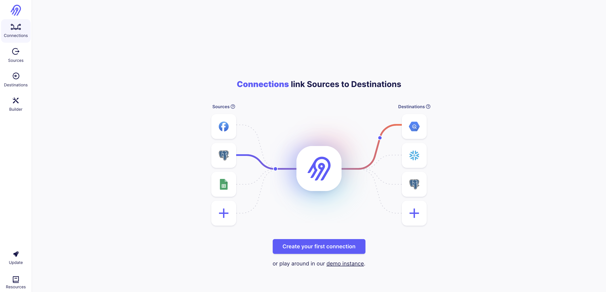
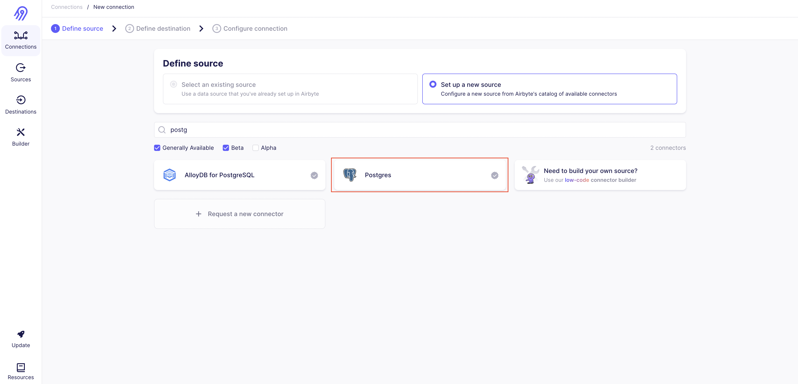
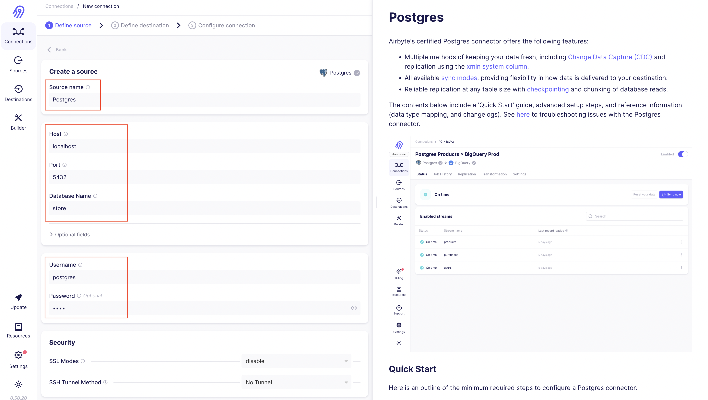
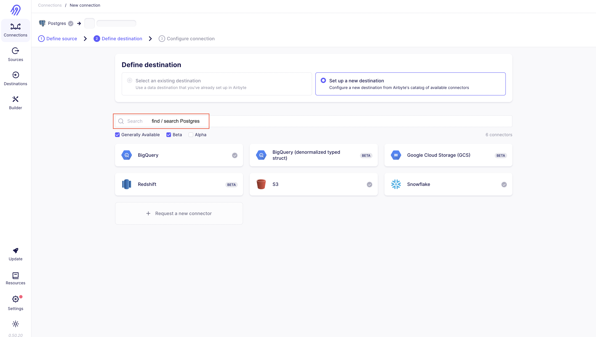
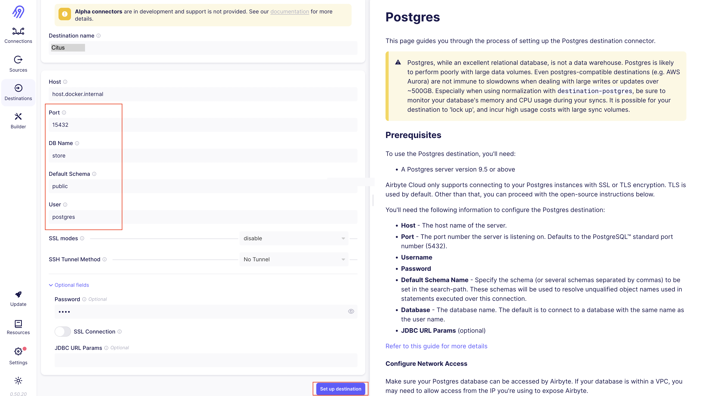
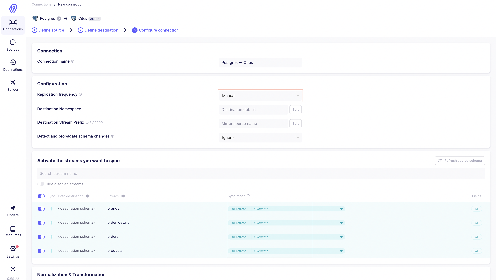
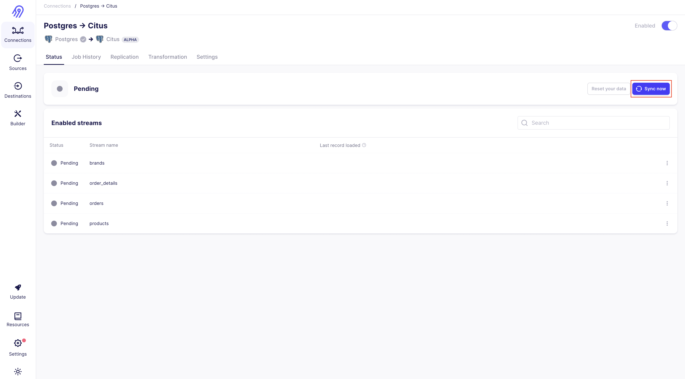
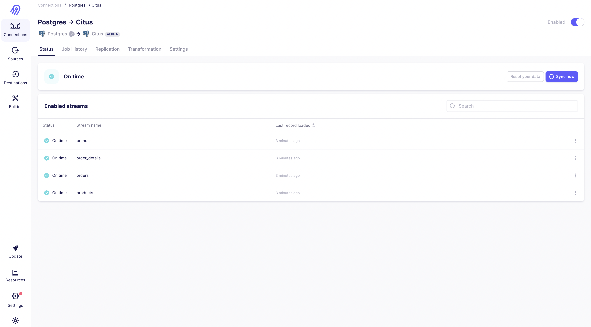
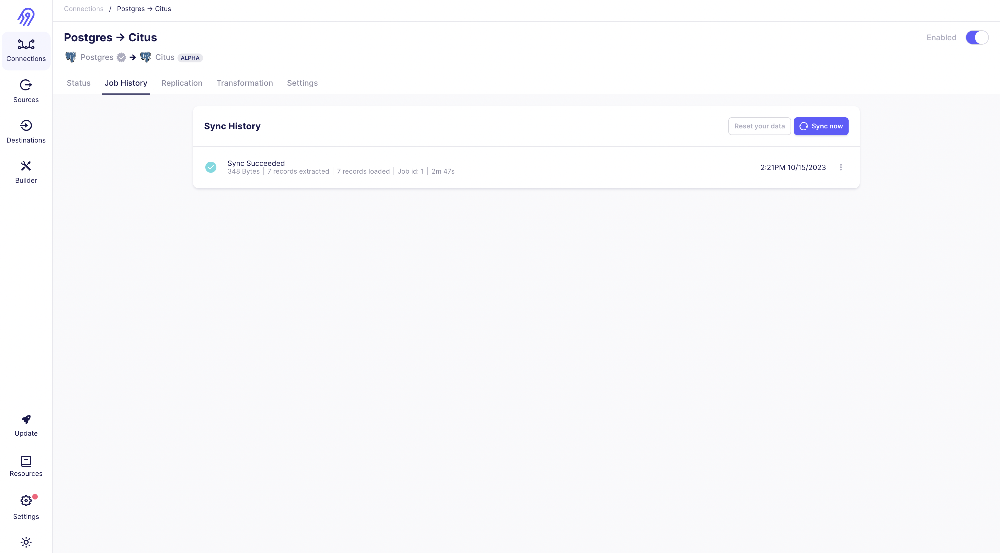

# Introduction to Airbyte

Airbyte is an open-source platform designed to streamline data integration tasks. It allows you to extract data from various sources, transform it into a suitable format, and load it into your preferred destinations, such as databases, data warehouses, or cloud storage.

# Why using airbyte for data ingestion?

Airbyte simplifies complex data integration processes. It offers a user-friendly interface, supports a wide range of sources and destinations, and automates data synchronization.

# Deploy Airbyte locally

- Run docker
- Make sure port 5432 is not occupied by any docker container or run this command to stop the container `docker stop <container_id>` 
- Run Postgreql, Citus and Airbyte locally via docker-compose

```
docker-compose -f ingestion_airbyte/docker-compose.yml up
```
- Make sure all the services are up and running.
<<IMAGE>>

# Setup connection in airbyte

- Open [http://localhost:8000/](http://localhost:8000/) in browser 

- Create connection



- Define source 



- Define postgresql connection detail (see config on [docker-compose](./ingestion_airbyte/docker-compose.yml))



- define destination







# Ingest data from Postgresql to Postgresql Citus

- Start synchronizing data



- Synchronizing status success 





# Check data in DBeaver

# Ingest data from API to Postgresql

https://blog.det.life/getting-started-with-airbyte-an-introductory-tutorial-for-beginners-58887bc3b4dd

# Check data in Postgresql

# Try it yourself
1. Ingest data from parquet file to Postgresql with airbyte.